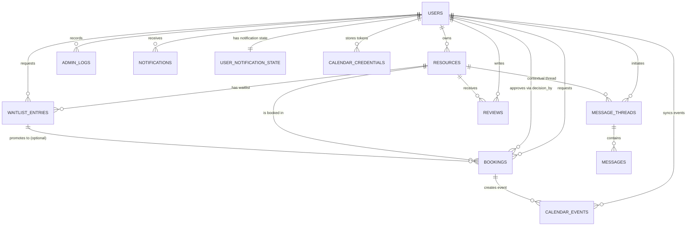

## Entity–Relationship Design – Campus Resource Hub (V3)

The V3 data model supports IU’s Campus Resource Hub: users authenticate, publish resources, request bookings, message one another, leave reviews, and synchronize calendars. The schema reflects role-aware access (student/staff/admin), resource ownership, booking workflows (including waitlists and Google Calendar sync), and moderation/audit needs.

### Entity catalog

#### users
- **Primary Key:** `user_id`
- **Key Attributes:** `name`, `email` (unique), `password_hash`, `role` (`student|staff|admin`), `department`, `profile_image`, `is_suspended`, `email_verified`, verification token fields, `created_at`.
- **Role in the system:** Master identity record. Roles drive authorization (owner approvals, admin dashboards). Suspension and verification flags guard access.

#### resources
- **Primary Key:** `resource_id`
- **Foreign Keys:** `owner_id → users.user_id`
- **Key Attributes:** `title`, `description`, `category`, `location`, `capacity`, `images` (comma-separated paths), `equipment`, `availability_rules`, `availability_schedule`, `is_restricted`, `status` (`draft|published|archived`), booking policy fields (`min/max_booking_minutes`, `booking_increment_minutes`, `buffer_minutes`, `advance_booking_days`, `min_lead_time_hours`), timestamps.
- **Role:** Represents rooms/equipment/events owned by a user. Status controls visibility; `is_restricted` governs whether owner approval is required.
- **Gap vs. brief:** No separate `resource_images` table—file paths are stored in `resources.images`.

#### bookings
- **Primary Key:** `booking_id`
- **Foreign Keys:** `resource_id → resources.resource_id`, `requester_id → users.user_id`, `decision_by → users.user_id`
- **Key Attributes:** `start_datetime`, `end_datetime`, `status` (`pending|approved|rejected|cancelled|completed`), `recurrence_rule`, decision metadata, audit timestamps.
- **Role:** Ties a requester to a resource for a time range. Booking status drives workflow; `decision_by` indicates owner/admin handling the request.

#### waitlist_entries
- **Primary Key:** `entry_id`
- **Foreign Keys:** `resource_id → resources`, `requester_id → users`, `booking_id → bookings`
- **Key Attributes:** `start_datetime`, `end_datetime`, `status` (`active|promoted|cancelled`), `recurrence_rule`, timestamps.
- **Role:** Captures overflow demand. When a slot frees up the entry can be promoted to a booking (`booking_id`).

#### message_threads
- **Primary Key:** `thread_id`
- **Foreign Keys:** `owner_id → users`, `participant_id → users`, `resource_id → resources (nullable)`
- **Key Attributes:** `thread_key` (unique business identifier), `created_at`.
- **Role:** Defines a conversation channel between two users, optionally scoped to a resource so booking discussions stay contextual.

#### messages
- **Primary Key:** `message_id`
- **Foreign Keys:** `thread_id → message_threads`, `sender_id → users`, `receiver_id → users`, `flagged_by → users`
- **Key Attributes:** `content`, `timestamp`, moderation flags (`is_flagged`, `flag_reason`, `is_hidden`).
- **Role:** Stores chat entries tied to threads with moderation capabilities.

#### reviews
- **Primary Key:** `review_id`
- **Foreign Keys:** `resource_id → resources`, `reviewer_id → users`, `flagged_by → users`
- **Key Attributes:** `rating` (1–5), `comment`, moderation flags, `timestamp`.
- **Role:** Lets users rate resources after completed bookings; flagged reviews can be hidden by admins.

#### admin_logs
- **Primary Key:** `log_id`
- **Foreign Keys:** `admin_id → users`
- **Key Attributes:** `action`, `target_table`, `details`, `timestamp`.
- **Role:** Audit trail for privileged actions (suspensions, review moderation, etc.).

#### notifications
- **Primary Key:** `notification_id`
- **Foreign Keys:** `user_id → users`
- **Key Attributes:** `channel`, `subject`, `body`, `status` (`pending|sent|logged|error`), `created_at`.
- **Role:** Outbox for in-app/email alerts (booking updates, approvals). Couples with `user_notification_state`.

#### user_notification_state
- **Primary Key / Foreign Key:** `user_id → users`
- **Key Attributes:** `last_seen_at`.
- **Role:** Tracks per-user notification read state for nav badges.

#### calendar_credentials
- **Primary Key:** `credential_id`
- **Foreign Keys:** `user_id → users`
- **Key Attributes:** `provider`, `credentials_json`, timestamps. Unique constraint `(user_id, provider)`.
- **Role:** Securely stores OAuth tokens for Google Calendar or other providers.

#### calendar_events
- **Primary Key:** `event_id`
- **Foreign Keys:** `booking_id → bookings`, `user_id → users`
- **Key Attributes:** `provider`, `external_event_id`, `html_link`, `synced_at`, unique `(booking_id, user_id, provider)`.
- **Role:** Tracks the external calendar entries created for bookings, supporting synchronization and cleanup.

### Relationships and cardinalities
- **User ↔ Resource (ownership):** One user owns many resources; each resource has exactly one owner (`resources.owner_id`). Ownership determines who can edit or approve bookings.
- **Resource ↔ Booking:** One resource can have many bookings; each booking references one resource.
- **User ↔ Booking (requester):** One user can request many bookings; every booking has a single requester (`bookings.requester_id`). Decision fields link to approvers (`bookings.decision_by`).
- **Resource/User ↔ Waitlist Entry:** Waitlist entries mirror bookings—one resource to many entries, one requester per entry. Promotion links to the resulting booking.
- **User ↔ MessageThread ↔ Message:** A thread is created between exactly two users (owner & participant) optionally tied to a resource; messages belong to threads and carry sender/receiver info for moderation.
- **Resource ↔ Review / User ↔ Review:** Each review references a single resource and reviewer; flagged reviews store the admin who hid them.
- **Booking ↔ Calendar Events:** Each booking can yield many calendar_event rows (one per connected user/provider). Credentials belong one-to-one per user/provider.
- **User ↔ Notifications:** Notifications target users; `user_notification_state` tracks metadata, enforcing a one-to-one state record per user.
- **Admin Logs:** Each log row references the admin who performed the action; no reverse FK, but semantics indicate admins produce many logs.

**Business-rule context:**  
- Role values (`student|staff|admin`) inform UI and authorization: owners (staff) review `pending` bookings; admins can suspend users and moderate content.  
- Resource `status` controls visibility; only `published` resources appear to non-owners.  
- Booking `status` transitions are enforced in DAL/service logic, respecting owner approval if `resources.is_restricted = 1`.  
- Reviews and messages include moderation flags; admins (or owners) can hide flagged content.  
- Notifications and calendar tables support asynchronous updates; failure statuses (`error`) or `logged` entries reflect the brief’s requirement for compliance logging.

**Gaps vs. project brief:** The AiDD brief references richer media handling (resource photos) and advanced approval workflows; in this V3 implementation, images are stored inline (no `resource_images` table) and approvals are handled via status fields plus optional waitlist promotions.

### ERD diagram

